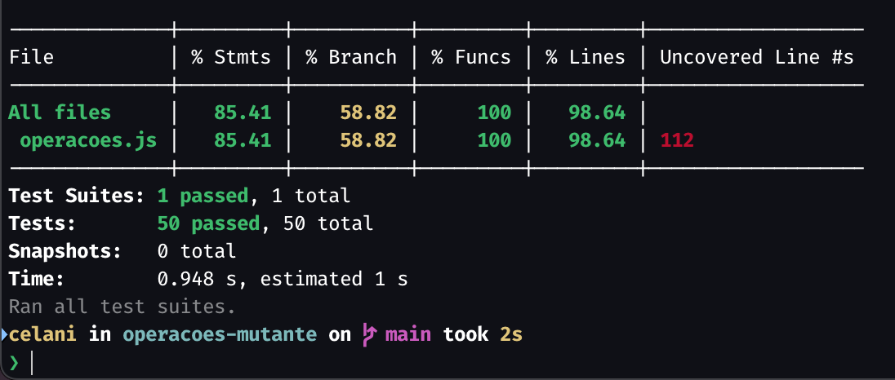

# Análise de Eficácia de Testes com Teste de Mutação

Pontifícia Universidade Católica de Minas Gerais
Teste de Software

Otávio Celani
499136

## 1. Análise inicial

As figuras a seguir documentam o estado da primeira execução: o relatório HTML do Stryker no navegador e o resumo de cobertura emitido pelo Jest no terminal.

*Figura 1.* Relatório do Stryker para `src/operacoes.js`: **73,71%** de pontuação de mutação total, **78,11%** sobre código coberto, **213** mutantes no total (**154** mortos, **44** sobreviventes, **12** sem cobertura, **3** em tempo esgotado). A barra superior e os marcadores no código (por exemplo, em `divisao` e `raizQuadrada`) evidenciam onde a suíte ainda não discrimina ou nem executa o trecho mutado.

*Figura 2.* Cobertura Jest sobre `operacoes.js`: **85,41%** de instruções, **58,82%** de ramos, **100%** de funções e **98,64%** de linhas (com linha **112** ainda listada como não coberta). Os cinquenta testes passaram, o que reforça que "tudo verde" na suíte não implica suíte forte frente a mutações.

Em conjunto, as duas figuras ilustram a **discrepância** entre métricas de cobertura (em especial linhas e funções elevadas) e a **pontuação de mutação global inferior** (~74%). A cobertura tradicional indica *se* o código foi exercitado; o teste de mutação indica *se* os testes **detectam** alterações semânticas. Ramos pouco cobertos (**58,82%**) e dezenas de sobreviventes alinham-se a asserções ainda genéricas (por exemplo, `toThrow()` sem mensagem ou um único caso "feliz" por função), que deixam passar variantes defeituosas do programa.

---

## 2. Análise de mutantes críticos (primeira execução)

Foram selecionados três exemplos representativos dentre os mutantes sobreviventes reportados pelo Stryker no relatório HTML gerado na primeira rodada.

### 2.1. `medianaArray`: remoção da ordenação

**Mutação:** substituir `[...numeros].sort((a, b) => a - b)` por uma cópia do array **sem** chamada a `sort`, ou ainda trocar o comparador por variantes incorretas (por exemplo, `() => undefined` ou `(a, b) => a + b`).

**Efeito:** o cálculo da mediana passa a usar a ordem original dos elementos, ou uma ordenação semanticamente inválida, em vez da ordenação crescente exigida pela definição.

**Por que a suíte original não matou o mutante:** o único teste relevante utilizava o array já ordenado `[1, 2, 3, 4, 5]`. Para esse arranjo, o elemento central coincide com o valor correto mesmo sem ordenar, de modo que o mutante permanece indistinguível do código original para aquela asserção.

### 2.2. `divisao`: literal de mensagem de erro esvaziado

**Mutação:** substituir a mensagem `'Divisão por zero não é permitida.'` por string vazia no `throw`.

**Efeito:** a divisão por zero continua a lançar exceção, preservando o comportamento verificado por `expect(() => divisao(5, 0)).toThrow()` sem argumentos.

**Por que a suíte original não matou o mutante:** `toThrow()` apenas exige que *alguma* exceção seja lançada, sem restringir o conteúdo. Assim, a alteração do texto do erro é **transparente** para o teste, embora seja regressão do ponto de vista de contrato da API e de diagnóstico para o utilizador.

### 2.3. `isPrimo`: laço e condições internas

**Mutações típicas:** transformar `if (n <= 1) return false` em `if (false) return false`, alterar o laço `for (let i = 2; i < n; i++)` (condição falsa, limite `i >= n`, corpo vazio), ou trocar `n % i === 0` por operadores que não detectam divisibilidade.

**Efeito:** o programa pode passar a classificar incorretamente compostos como primos, ou ignorar casos-limite como `0`, `1` e `2`.

**Por que a suíte original não matou o mutante:** um único `expect(isPrimo(7)).toBe(true)` confirma apenas um caminho "positivo". Diversas mutações preservam o retorno `true` para `n = 7`, pois o laço ainda não expõe a falha introduzida, ou deixam de exercitar ramos críticos que só se revelam com **não-primos**, **números limite** e **divisores explícitos**.

---

## 3. Solução implementada

Foram acrescentados **casos de borda e asserções mais fortes** nos testes já existentes (mantendo a estrutura de cinquenta casos alinhados às funções), entre os quais:

- **Mediana:** entradas **desordenadas** com comprimento ímpar, entradas de **comprimento par** (média dos dois centrais) e chamada com **array vazio** com `toThrow` incluindo trecho da mensagem esperada, forçando ordenação, ramo par e validação de erro.
- **Divisão por zero:** `toThrow` com a **mensagem literal** esperada, de modo que o mutante que esvazia a string deixe de passar.
- **Raiz quadrada, fatorial, inverso, max/min da lista vazia, mediana vazia:** combinação de valores válidos (por exemplo, `raizQuadrada(0)`, `fatorial(0)` e `fatorial(1)`) com entradas inválidas e mensagens de erro explícitas, cobrindo condições `if` e literais previamente sem cobertura ou fracos perante mutações.
- **`isPar` / `isImpar`:** expectativas `false` para entradas de paridade oposta, destruindo mutantes que fixam `return true` ou alteram o operador aritmético.
- **`isPrimo`:** expectativas para `2`, compostos (`4`, `9`) e não-primos limite (`0`, `1`), obrigando o laço e os retornos antecipados a produzir resultados distintos dos mutantes degradados.
- **`mediaArray` / `produtoArray`:** array vazio; em código, `produtoArray` passou a usar `reduce` sem valor inicial redundante, de forma que o guard de array vazio deixe de ser **semanticamente redundante** perante o `reduce`.
- **`clamp`:** valores abaixo do mínimo, acima do máximo e intervalos **inválidos** (`min` e `max` em ordem não usual), discriminando ramos `if` e operadores de comparação.
- **Conversões térmicas:** segundo ponto de referência (`100 °C` ↔ `212 °F`) para resistir a mutações aritméticas em expressões com divisão encadeada.
- **Comparações (`isMaiorQue`, `isMenorQue`, `isEqual`):** casos `false` e empates, evitando que `return true` ou relaxamentos `>=` / `<=` passem despercebidos.

Esses testes são **eficazes** porque cada um **restringe o conjunto de programas equivalentes** aceitável: combinações de entrada e saída (ou mensagem) que o código mutado deixa de satisfazer, ao passo que a implementação correta continua a satisfazê-las.

---

## 4. Resultados finais

Após a revisão da suíte e o pequeno ajuste em `produtoArray`, nova execução do Stryker indicou pontuação de mutação da ordem de **97,6%** sobre `operacoes.js`, com **zero** mutantes em `NoCoverage`, número de mutantes morto superior ao da primeira execução e apenas **poucos sobreviventes** restantes, em grande parte ligados a **mutações equivalentes** (por exemplo, guardas redundantes com o laço ou `reduce` em casos-limite já cobertos por outras propriedades do código).

O ganho absoluto de cerca de **vinte pontos percentuais** na pontuação de mutação evidencia que a qualidade da suíte passou a ser avaliada de modo muito mais exigente do que a métrica de cobertura por execução isolada sugeria na configuração inicial.

---

## 5. Conclusão

O teste de mutação complementa a cobertura estrutural ao perguntar, para cada alteração sintática plausível, se a suíte **distingue** o programa original de variantes defeituosas. No trabalho descrito, essa perspectiva revelou lacunas que métricas tradicionais mascaravam e orientou a introdução de casos de teste mais informativos. Em contextos acadêmicos e profissionais, incorporar o teste de mutação ao ciclo de revisão de testes contribui para **reduzir falsa confiança** em percentuais de cobertura elevados e para **priorizar** o reforço de asserções e cenários de borda onde o retorno sobre o esforço de escrita de testes é maior.